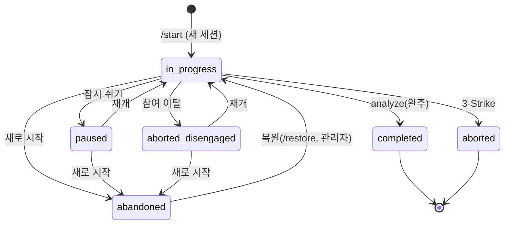

# 진단 세션 상태 전이 표

`diagnosis_sessions.status` 의 모든 전이는 이 표에 있어야 한다. 표에 없는 전이는 만들지 않는다.
코드의 단일 정의: `diag_project/routes/diagnoses.py` 의 `RESUMABLE_STATUSES`, `ABANDONED`,
`mark_abandoned`, `apply_restore`. 이 파일과 그 주석은 항상 같이 고친다.

| 상태 | 뜻 | 재개(코치 선택 → /start) | 참가자 화면 |
|---|---|---|---|
| `in_progress` | 진행 중 | 재개 | 채팅 이어하기 |
| `paused` | 휴식(잠시 쉬기) | 재개 | 채팅 이어하기 |
| `aborted_disengaged` | 참여 이탈로 중단 — 원장 보존 | 재개 | 채팅 이어하기 |
| `abandoned` | 새로 시작으로 **보관** — 원장·대화 유지, 삭제 아님 | 재개 안 함 | 없음(관리자 복원만) |
| `completed` | 분석 완료 | 없음(새 세션) | 리포트 |
| `aborted` | 3-Strike 강제 종료 — 종점 | 없음(새 세션) | 종료 안내 |

## 전이

| 전이 | 경로 | 비고 |
|---|---|---|
| `in_progress → paused` | submit_message(잠시 쉬기) | |
| `paused → in_progress` | submit_message(다시 말을 걸면) | 재개 |
| `in_progress → completed` | reports.analyze(5개 챕터 완주) | `status_after_analyze` — 미완주면 이전 상태 보존 |
| `in_progress → aborted` | submit_message(3-Strike) | 종점. 재개·복원 불가 |
| `in_progress → aborted_disengaged` | submit_message(참여 이탈 확정) | 원장 보존 |
| `aborted_disengaged → in_progress` | submit_message(재개) | |
| `in_progress · paused · aborted_disengaged → abandoned` | `POST /diagnoses/abandon`, `POST /diagnoses/start {force_new}` | **새로 시작**. 확인 팝업을 거친다 |
| `abandoned → in_progress` | `POST /diagnoses/restore`, `POST /admin/sessions/{id}/restore` | **복원 — 이 경로만**. 같은 참가자의 다른 재개 가능 세션은 `abandoned` 로 |

## 복원 규칙 (`apply_restore`)

- 대상 세션이 `abandoned`(또는 재개 가능 상태)면 `in_progress` 로. 이미 `in_progress` 면 멱등.
- 같은 참가자의 다른 `in_progress · paused · aborted_disengaged` 세션은 전부 `abandoned` 로 보관한다
  (참가자당 진행 중 세션은 항상 1개).
- `completed` · `aborted` 는 복원 불가(409).
- 원장(asked/measured/turns)·메시지·이벤트는 건드리지 않는다. 상태만 바뀐다.

## 참가자 화면 흐름 (코치 선택)

1. 같은 코치 선택 → 팝업 없이 곧바로 채팅(자가진단 건너뜀). 채팅 상단 한 줄 "이어서 진행합니다".
2. 다른 코치 선택 → 선택 팝업 [기존 코치와 이어하기] [새 코치로 새로 시작]. 새로 시작은 3 으로.
3. 새로 시작 확인 팝업 [취소] [새로 시작(골드 아웃라인)] → `/abandon` → 새 세션 → 자가진단.
4. 되돌리기 — (a) 자가진단 상단 배너 "[이전 진단으로 돌아가기]" (첫 메시지 전까지) → `/restore`.
   (b) 이미 진행한 뒤에는 관리자 참가자 페이지의 [복원] 버튼(확인 팝업)으로만.

## 인증 메모

`/abandon` · `/restore` 는 participant_id / session_id 를 body 로 받고 참가자 인증이 없다.
(B) 인증 작업에서 소유자 검증 필수. 그전까지는 파일럿 범위(내부 5명)라 감수.
관리자 경로 `/admin/sessions/{id}/restore` 는 `get_current_admin` + 회사 격리로 보호한다.
